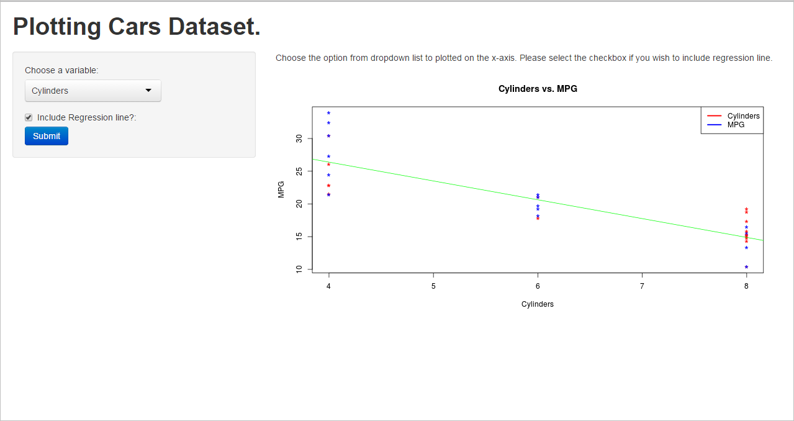

## Summary  

1. This application use "mtcars" dataset to plot MPG vs. Variables selected from dropdown list.
2. The dropdown list contains 4 variables  
  . Weight  
  . Cylinders  
  . Horsepower  
  . Transmission  

Please click [here](https://jaihokashi.shinyapps.io/ShinyApps) to launch the application.

--- 

## Application User Interface  

Application URL : https://jaihokashi.shinyapps.io/ShinyApps/  

--- .class #slide3 

## Code sample  

library(shiny)

data(mtcars)

shinyServer( 
        function(input, output) {
                xvarInput <- reactive({
                        switch(input$xvariable,
                               "Weight"=mtcars$wt,
                               "Cylinders"=mtcars$cyl,
                               "Horsepower"=mtcars$hp,
                               "Transmission"=mtcars$am)
                })
                output$newPlot <- renderPlot({
                        plot(xvarInput(), mtcars$mpg, main = paste(input$xvariable, "MPG", sep=" vs. "), cex=1.5, pch="*", col = (c("red","blue")), xlab = input$xvariable, ylab = "MPG")
                        legend("topright", c(input$xvariable, "MPG"), lty=c(1,1), lwd=c(2.5,2.5),col=c("red","blue"))
                        if(input$reglinecheck) {
                                abline(lm(mtcars$mpg ~ xvarInput()), col="green")                                
                        }
                }) 
        }
)  

--- .class #slide4 

## Reference  
1. http://slidify.github.io/  
2. https://class.coursera.org/devdataprod-007/lecture  

